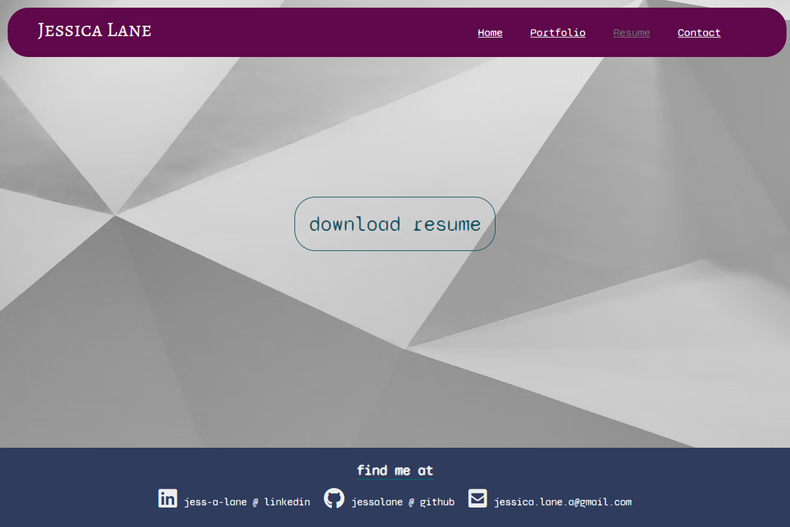

  # React Portfolio

  

  -------

  ## Description
  The following page is a portfolio based on my own body of work. The code is generated with React, custom CSS, JavaScript and is fully mobile reactive. All of the project information is added into an object that makes for ease of updating the content, and could be moved into a databse when my body of work has grown some.
  
  ## Table of Contents
  [Installation](#installation)

  [License](#license)

  ## Installation
  No installation should be needed.

  ## Usage
  The following are also some screenshots based on what the webpage should look like.

  
  
  
  

  ## License
  
Copyright 2022 Jessica Lane

Permission is hereby granted, free of charge, to any person obtaining a copy of this software and associated documentation files (the "Software"), to deal in the Software without restriction, including without limitation the rights to use, copy, modify, merge, publish, distribute, sublicense, and/or sell copies of the Software, and to permit persons to whom the Software is furnished to do so, subject to the following conditions:

The above copyright notice and this permission notice shall be included in all copies or substantial portions of the Software.

THE SOFTWARE IS PROVIDED "AS IS", WITHOUT WARRANTY OF ANY KIND, EXPRESS OR IMPLIED, INCLUDING BUT NOT LIMITED TO THE WARRANTIES OF MERCHANTABILITY, FITNESS FOR A PARTICULAR PURPOSE AND NONINFRINGEMENT. IN NO EVENT SHALL THE AUTHORS OR COPYRIGHT HOLDERS BE LIABLE FOR ANY CLAIM, DAMAGES OR OTHER LIABILITY, WHETHER IN AN ACTION OF CONTRACT, TORT OR OTHERWISE, ARISING FROM, OUT OF OR IN CONNECTION WITH THE SOFTWARE OR THE USE OR OTHER DEALINGS IN THE SOFTWARE.
      

  [MIT](https://opensource.org/licenses/MIT)

  ---

  ## Questions
  If you have further questions please reach out to me through the methods listed below:

  email: jessica.lane.a@gmail.com

  GitHub: jessalane
  
